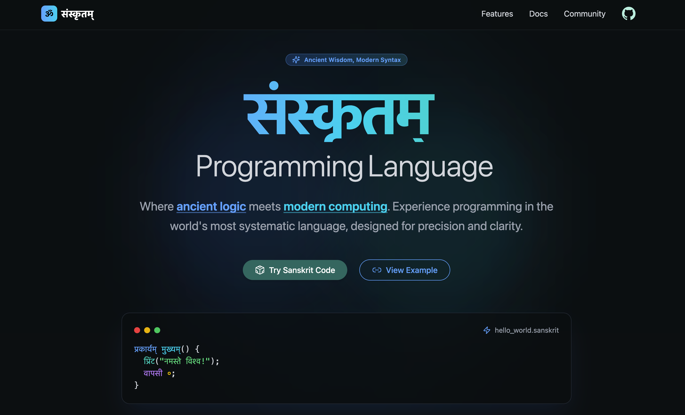

# संस्कृतम् | SanScript: The New Gen



---

## 🚀 About This *Totally Serious* Project

Behold **SanScript** - where ancient mantras meet modern `console.log()`. This *educational* (read: hilarious) playground lets you:

- Write "code" in Sanskrit keywords (because `if` is so 20th century)
- Pretend you're a NASA linguist from that *one* 1985 paper
- Marvel at how `प्रिंट("नमस्ते")` somehow outputs to browser console

```javascript
// Real* Sanskrit Programming Example
प्रकार्यम् factorial(अंकः n) {
  यदि (n == ०) {
    वापसी १;
  } अन्यथा {
    वापसी n * factorial(n - १);
  }
}
// *Not actually real
```


## 💻 Tech Stack (The Real Stuff)

| What's Working    | What's Allegedly Working          |
|------------------|---------------------------------|
| React 18         | Vedic JavaScript Interpreter™   |
| Framer Motion    | Chakra Alignment Engine          |
| Tailwind CSS     | Ancient Sanskrit CSS Rishi       |
| Vite             | Yajna-powered HMR                |

---

## 🌐 Preview

Experience this groundbreaking tech:  
**Preview Link (Coming after the next Yuga)**

---

## Why This Exists

Because someone actually claimed Sanskrit is better for programming

To see if **वापसी** feels more enlightened than **return**

---

## Future Plans

- Sanskrit-based OS kernels (because why not? 😄)
